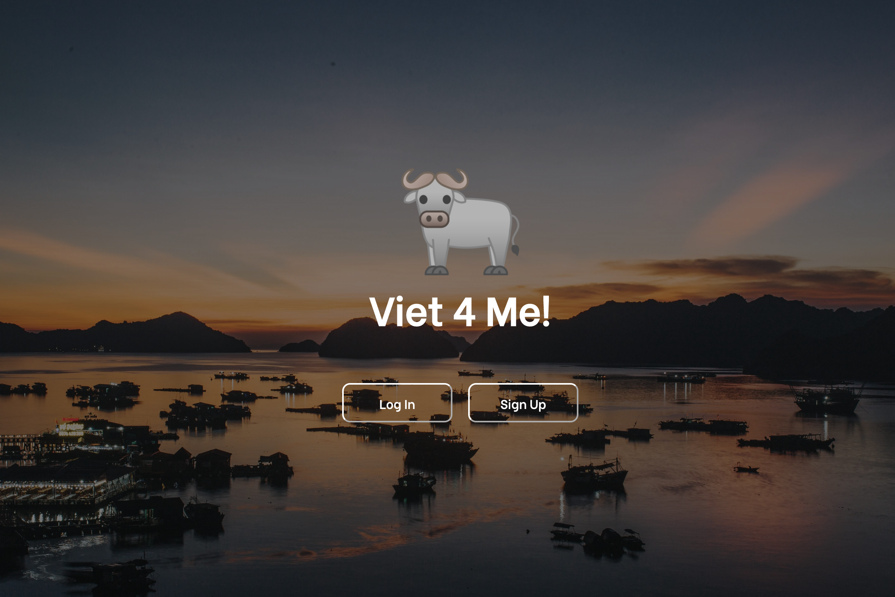
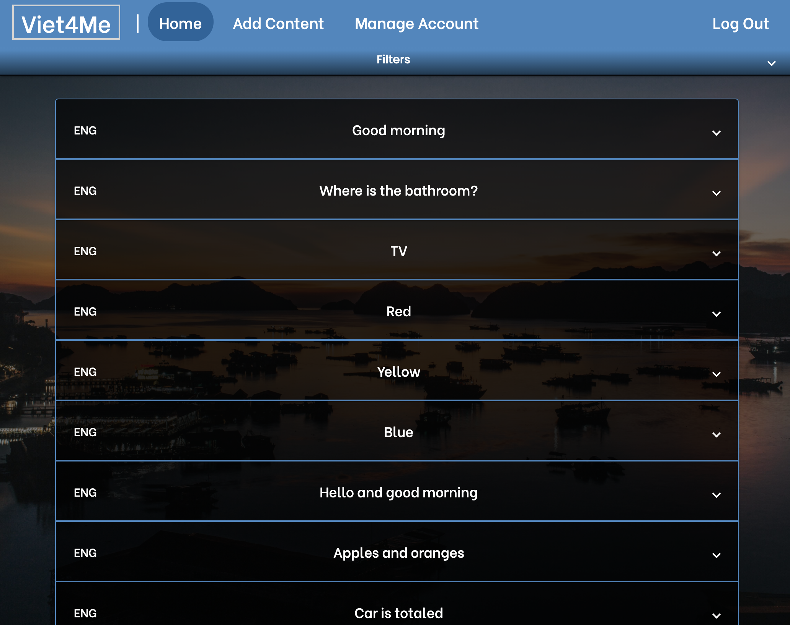
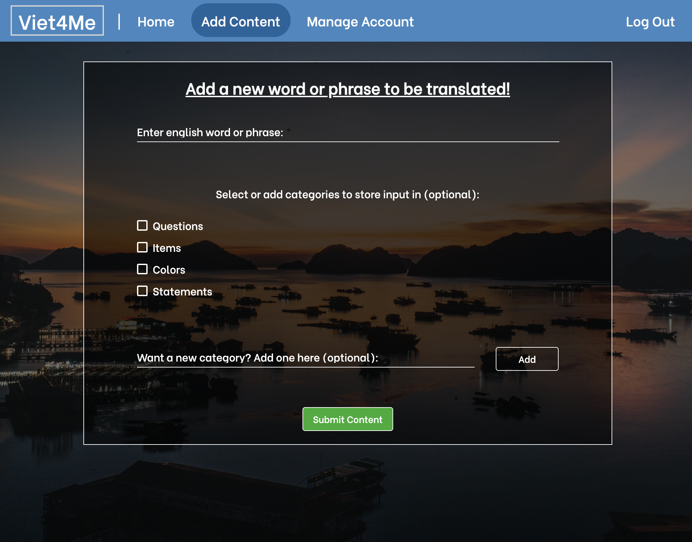

# Table of Contents

- [Project Description](#viet4me)
- [Project Link](#project-link)
- [Functionality](#functionality)
- [Utilized Software](#utilized-software)
- [Previous Features Depreciated From Project](#previous-features-depreciated-from-project)
- [Things Currently In Progress](#things-currently-in-progress)
- [Ideas to Implement In The Future](#ideas-to-implement-in-the-future)
- [Images of Project](#images-of-project)

# Viet4Me

The project is a "self-learning" Vietnamese app where you are able to translate any word or phrase from English into Vietnamese. Alongside its translation, you are able to make posts and are able to categorize and filter certain posts to view! Think of it as a Google Translate meets Quizlet application.

## Project Link

As of 9/22/2020, the project is still being developed and has not yet been hosted to view in working order. Update link will be here (in the hopefully near future!).

## Functionality

* __In terms of user__:
  * Creating an account and storing in database
  * Adding a post (comprised of entering an English word/phrase to translate, adding/choosing categories to store in)
  * Added posts includes an english phrase, which is translated into Vietnamese via Google Translate API upon viewing posts in home page
  * Editing a post (the phrase to translate, the categories the current post is stored in)
  * Deleting a post
  
* __In terms of user experience__: 
  * Correct authentication and authorization to add/edit/delete posts that the user themselves created in the first place (and viewing only their posts)
  * Animation of the buffalo and login + signup forms 
  * Filtering posts via category and search bar
  * Filter option to display english content or viet content on top of expansion panels (with the other inside the expansion panel)
  * Vietnamese keyboard of viet characters displayed to use for search bar to filter via search bar (Note: keyboard only displayed when viet display filter option selected)
  * Filter option to have all panels expanded or collapsed on button click
  
## Utilized Software

The application utilizes the __MEAN__ stack (__MongoDB, Express.js, Angular, and Node.js__). 

Libraries included: 

* __mongoose__: working with Node.js and MongoDB a bit easier (syntax-wise)
* __mongoose-unique-validator__: validator for unique emails in database
* __express__: working with Node.js a bit easier
* __jsonwebtoken__: part of the authorization and authentication for user log in and sign up
* __bcrypt__: hashing of passwords

## Previous Features Depreciated From Project

* __Use-as-guest feature__
  * meant for first time visitors of site to be able to use all functionality of project (add/edit/deleting their own posts) 
  * removed for the case of motivated user involvement (in creating an account to use features), as opposed to allowing them to use features without creating account
* __Image for each post__
  * was to implement a select-image in the create post section, where users will be able to select image from a select few (images from some sort of Google Image API) 
  * removed (from design, wasn't implemented functionally) as it was deemed unnecessary

## Things Currently In Progress

* 'Manage Account' Button where user can edit their chosen email and password, as well as removing categories (even if there are posts within said category)
* Cleaning the code (lots of spacing issues, comments to rewrite/write, removing of console.logs)
* Web responsiveness (especially for mobile)
* Pagination (as to not load all posts immediately, affecting loadtime)
  * (Note: has been implemented but commented out as it was not working as intended with category filter and search bar filter)
  
## Ideas to Implement In The Future

* Google text-to-speech for the vietnamese translation for each post
* Audio capture feature (to capture your voice pronunciating the vietnamese word or phrase)
  
## Images of Project
  
#### Landing page   

#### Login and signup form 

#### Home page when user logs in

#### Filter expansion panel in home page

#### Filter expansion panel when viet display filter option selected (notice the 'Click Me!' expansion bar)

#### Viet keyboard expansion panel (open)

#### Adding post form

#### Expanded post view

